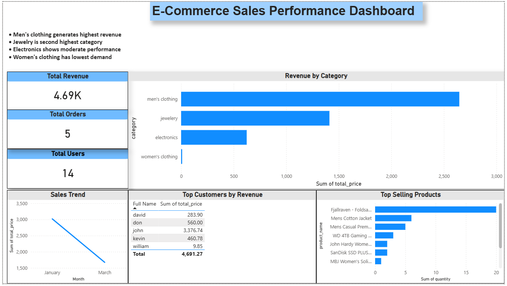

# 📊 E-Commerce Data Pipeline & Analytics Dashboard

## 🚀 Project Overview

This project demonstrates an **end-to-end data pipeline** built using Airflow, Python, MySQL, and Power BI.

The pipeline extracts real-time data from an external API, processes it into structured datasets, stores it in a relational database, and visualizes insights through an interactive dashboard.

---

## 🛠 Tech Stack

* **Apache Airflow** – Workflow orchestration
* **Python (Pandas)** – Data transformation
* **MySQL** – Data storage (Star Schema)
* **Power BI** – Data visualization

---

## 🔄 Data Pipeline Architecture

API → Airflow → Python Transformation → MySQL → Power BI

---

## 📥 Data Extraction

* Source: https://fakestoreapi.com/
* Endpoints used:

  * `/products`
  * `/users`
  * `/carts`

Airflow DAG automates API data extraction and stores raw JSON files.

---

## 🧹 Data Transformation

* Converted nested JSON into structured format
* Created:

  * `dim_products`
  * `dim_users`
  * `fact_orders`
* Handled missing values and duplicates
* Calculated total revenue per order

---

## 🗄️ Data Modeling

Implemented a **star schema**:

* **Fact Table**

  * `fact_orders` (transactions)

* **Dimension Tables**

  * `dim_products`
  * `dim_users`

---

## 📊 Dashboard Features (Power BI)

* Total Revenue KPI
* Total Orders KPI
* Total Users KPI
* Revenue by Category
* Top Selling Products
* Top Customers by Revenue
* Sales Trend Over Time

---

## 📈 Key Insights

* Men's clothing generates the highest revenue
* Jewelry is the second highest category
* Electronics shows moderate performance
* Women's clothing contributes the least
* Top categories drive majority of sales

---

## 📸 Dashboard Preview

---

## 💬 What I Learned

* Building end-to-end ETL pipelines
* Data modeling using fact & dimension tables
* Writing SQL joins for analytics
* Designing business-focused dashboards
* Using Airflow for workflow automation

---

## 🔮 Future Improvements

* Add incremental data loading
* Use cloud storage (S3 / GCS)
* Replace SQLite with production database
* Automate full pipeline (extract + transform + load)

---

## 👨‍💻 Author

**Jeevan M**
